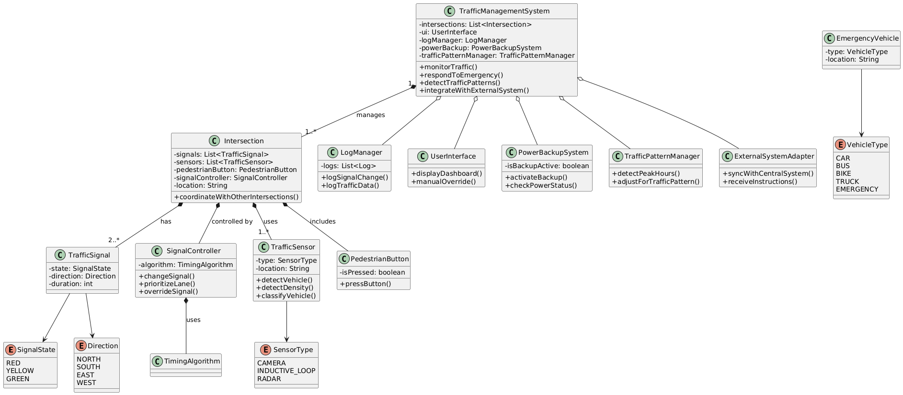

# Traffic Control System

## Requriements
1. System should handle signals like RED,YELLOW and GREEN
2. It should be periodically change the signal for particular time interval
3. System should identify on which side traffic is more and change the signal accordingly
4. System should be able to handle emergency vehicles and give them priority
5. System should be able to handle pedestrian crossing requests
6. System should log the signal changes and traffic conditions for analysis
7. System should have a user interface for monitoring and manual control
8. System should be able to integrate with existing traffic management systems
9. System should be able to handle multiple intersections and coordinate signals between them
10. System should be able to handle power outages and have a backup system in place
11. System should be able to handle different traffic densities (low, medium, high)
12. System should be able to handle different traffic patterns (peak hours, off-peak hours, etc.)
13. This is for Road Traffic Management System
14. The system should be able to detect and classify vehicles (cars, buses, bikes, trucks) to better manage lane allocation and prioritize larger or public transport vehicles.
15. The system should dynamically adjust signal timing not only based on preset intervals but also on live traffic data from sensors or cameras.

## Class Diagram

